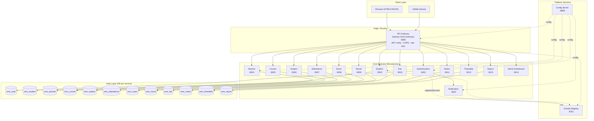
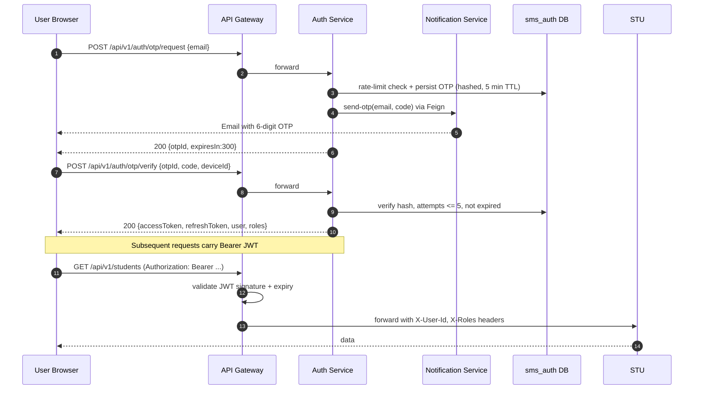

# System Architecture

## 1. High-Level Architecture



## 2. Authentication Flow (OTP + JWT)



## 3. Request Lifecycle

1. Client hits **API Gateway** (`:8080`).
2. Gateway runs filters: CORS, request logging, rate limiting (Redis token-bucket optional), JWT validation.
3. On valid JWT, Gateway injects `X-User-Id`, `X-User-Email`, `X-Roles` headers and routes via Eureka service IDs (e.g. `lb://student-service`).
4. Downstream service reads identity from headers, applies RBAC at controller/method level.
5. Cross-service calls use OpenFeign (client-side load-balanced via Spring Cloud LoadBalancer).
6. Each service publishes health (`/actuator/health`) and metrics (`/actuator/prometheus`).

## 4. Centralized Configuration

- `config-server` reads from a local filesystem backend at `config-server/src/main/resources/config/`.
- Each service has `bootstrap.yml` pointing to `http://localhost:8888`.
- Per-service configs: `application-{service}.yml` (e.g. `application-student-service.yml`).
- Sensitive values come from environment variables; `${DB_PASSWORD}`, `${JWT_SECRET}`, `${MAIL_PASSWORD}`.

## 5. Service Discovery

- `service-registry` runs Eureka on `:8761`.
- All other services declare `eureka.client.serviceUrl.defaultZone=http://localhost:8761/eureka/`.
- Gateway routes use `lb://<service-id>` for client-side load balancing.

## 6. Resilience & Cross-Cutting Concerns

| Concern | Mechanism |
| --- | --- |
| Retries / circuit breaking | Resilience4j on Feign clients |
| Rate limiting | Gateway filter (in-memory token bucket; Redis optional) |
| Tracing | Micrometer Tracing + W3C `traceparent` headers |
| Logging | JSON logs via Logback + correlation IDs |
| Metrics | Actuator + Prometheus endpoint |
| Validation | `jakarta.validation` annotations + global `@ControllerAdvice` |
| Exceptions | Standardized error response envelope |

## 7. Standard Response Envelope

```json
{
  "status": "SUCCESS",
  "message": "Student created",
  "timestamp": "2026-06-25T10:15:30Z",
  "data": { "id": 42, "rollNumber": "CSE-2026-042" },
  "errors": null
}
```

## 8. Folder Layout

```
student-management-system/
├── docs/                  # Architecture, DB, API, security docs
├── frontend/              # HTML / CSS / vanilla JS UI
├── config-server/         # Spring Cloud Config
├── service-registry/      # Eureka
├── api-gateway/           # Spring Cloud Gateway
├── authentication-service/
├── notification-service/
├── student-service/
├── teacher-service/
├── course-service/
├── subject-service/
├── attendance-service/
├── exam-service/
├── result-service/
├── fee-service/
├── notice-service/
├── timetable-service/
├── report-service/
├── admin-dashboard-service/
├── docker/                # Dockerfiles, compose, init SQL
└── kubernetes/            # Manifests
```
