# Database Design (Database-per-Service)

A single MySQL 8.x instance hosts one **schema** per service. There are **no cross-schema foreign keys** — referential integrity across services is enforced at the application layer using IDs (and Feign calls when stricter consistency is needed).

> Credentials are loaded from environment variables. Local dev defaults:
> `host=localhost`, `port=3306`, `user=root`, `password=<your-db-password>`.

## Schemas

| Schema | Owner Service |
| --- | --- |
| `sms_auth` | authentication-service |
| `sms_notification` | notification-service |
| `sms_student` | student-service |
| `sms_teacher` | teacher-service |
| `sms_course` | course-service |
| `sms_subject` | subject-service |
| `sms_attendance` | attendance-service |
| `sms_exam` | exam-service |
| `sms_result` | result-service |
| `sms_fee` | fee-service |
| `sms_notice` | notice-service |
| `sms_timetable` | timetable-service |
| `sms_report` | report-service |

## 1. `sms_auth`

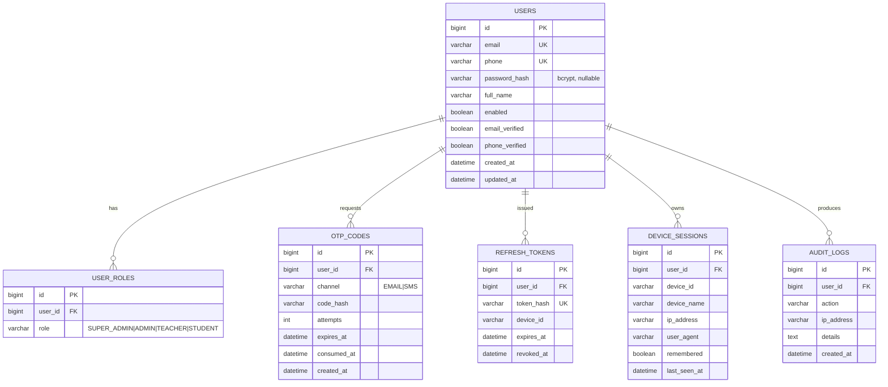

## 2. `sms_student`

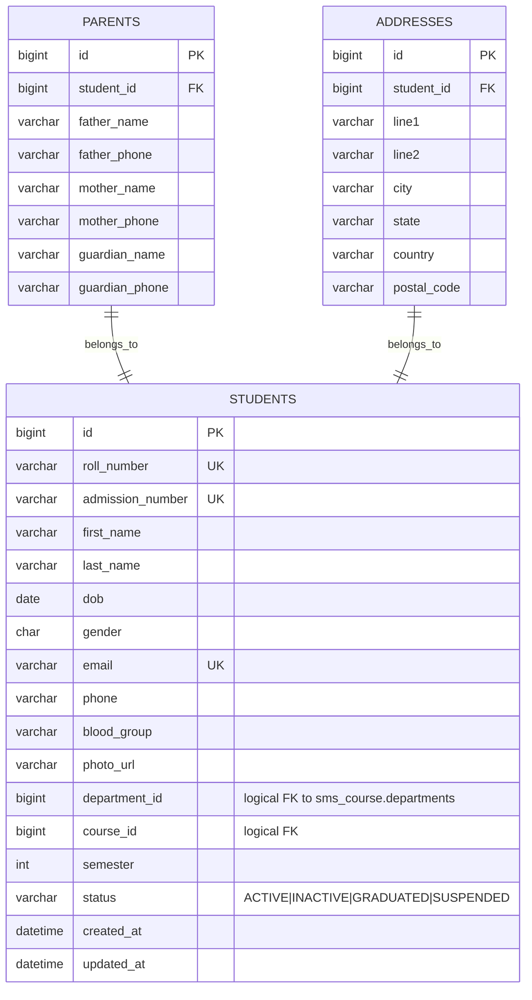

## 3. `sms_teacher`

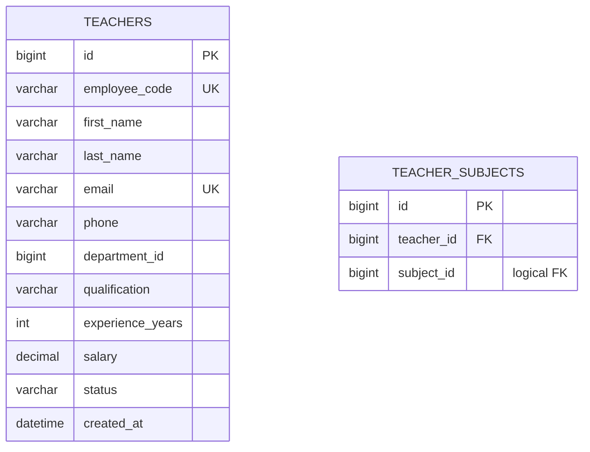

## 4. `sms_course`

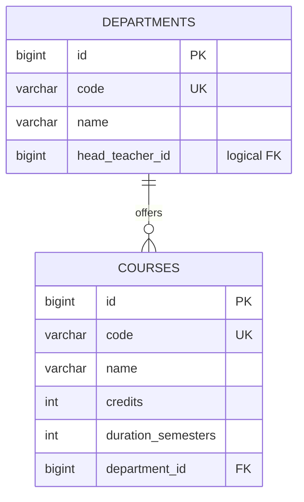

## 5. `sms_subject`

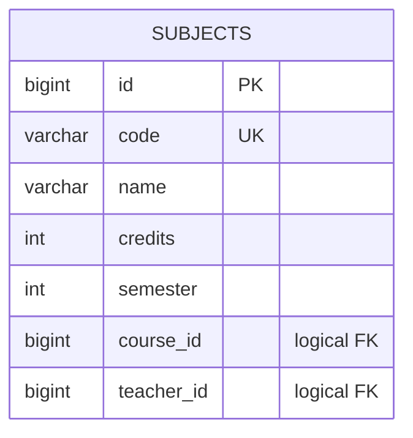

## 6. `sms_attendance`

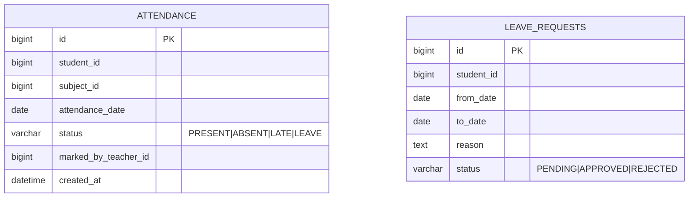

## 7. `sms_exam`

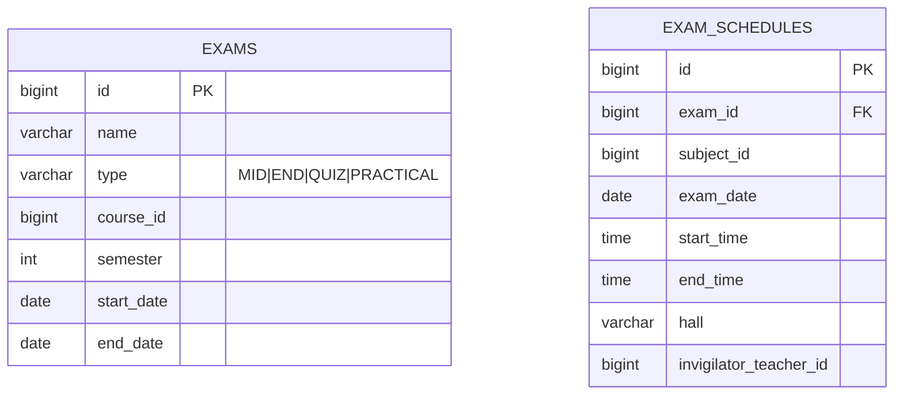

## 8. `sms_result`

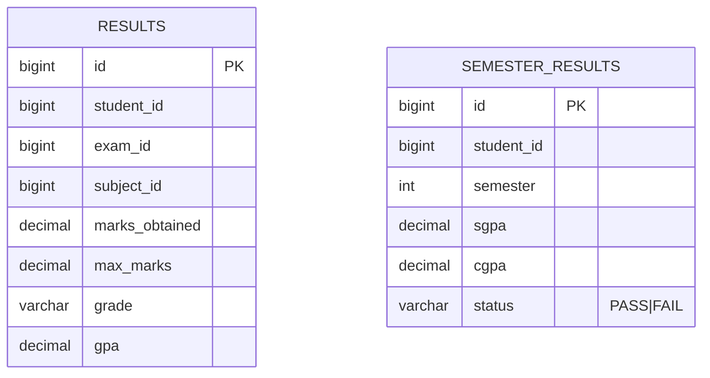

## 9. `sms_fee`

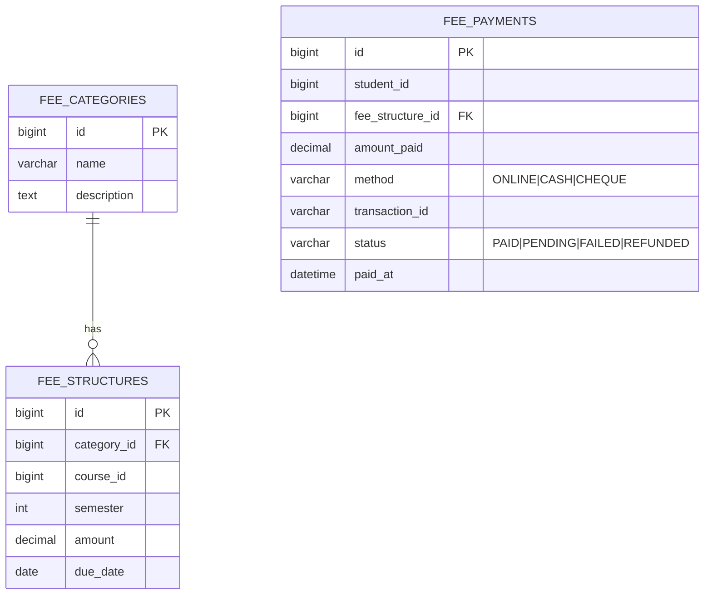

## 10. `sms_notice`

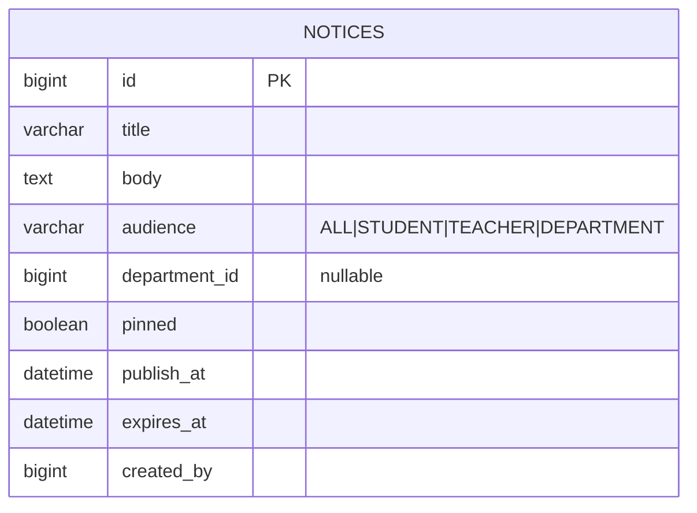

## 11. `sms_timetable`

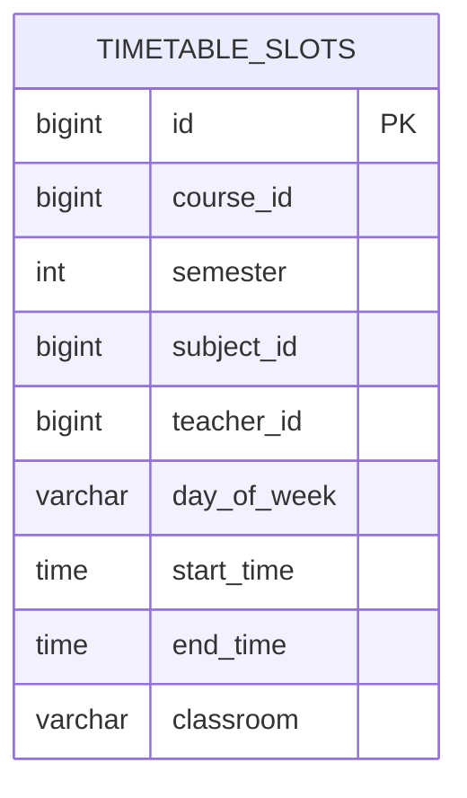

## 12. `sms_notification`

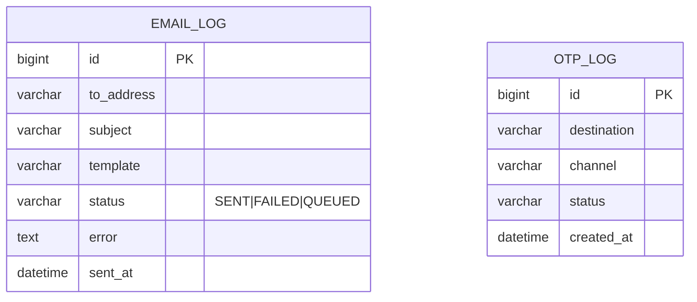

## Seed Data

Each service's `src/main/resources/db/migration/V2__seed_data.sql` inserts a minimal demo dataset:

- 1 SUPER_ADMIN: `admin@sms.edu`
- 1 ADMIN: `registrar@sms.edu`
- 2 TEACHERS, 5 STUDENTS
- 3 DEPARTMENTS (CSE, ECE, ME)
- 4 COURSES, 12 SUBJECTS
- Sample timetable, fee structure, notices

## Bootstrap SQL

See `docker/init/00-create-databases.sql` for the schema-creation script.
